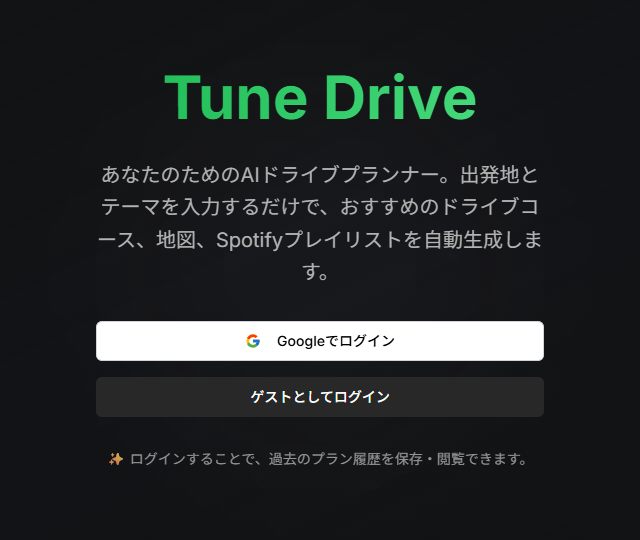

# AIドライブプラン提案アプリ（Tune Drive）

Next.jsとSupabaseを用いたAIドライブプラン提案アプリです。  
ユーザーが「出発地」「時間」「同行者」「テーマ」などを入力することで、生成AI（OpenAI GPT-4 API）を活用して自動的に最適なドライブプランを提案します。  
位置情報やスポット情報の管理・保存も可能で、学習・趣味を活かした課題解決型のアプリケーションです。

---

## 🔗 サイトURL

[https://tunedrive.vercel.app/](https://tunedrive.vercel.app/)

※ゲストログインボタンから、メールアドレスとパスワードを入力せずにログインできます。

---

## 🖼 サイトイメージ

---

## ⚙️ 使用技術

- **フロントエンド**：Next.js 15.3（App Router）  
- **バックエンド**：Next.js API Routes、OpenAI API（GPT-4）  
- **データベース**：Supabase（PostgreSQL）  
- **認証**：Supabase Auth（メール・Googleログイン対応）  
- **デプロイ**：Vercel  
- **バージョン管理**：Git / GitHub  
- **CI/CD**：GitHub Actions（ESLint対応）  
- **開発補助**：ChatGPT、v0.dev、GitHub Copilot Chat  

---

## 🧭 機能一覧

- ユーザー認証  
  - メール認証によるログイン／登録機能  
  - Googleアカウントログイン対応  
- ドライブプラン自動生成（OpenAI GPT-4 API使用）  
- スポット情報の閲覧・保存機能    
- ログインユーザーによるマイプラン閲覧 
- UIのレスポンシブ対応（モバイル／PC）  
- ゲストログイン機能  

---

## 🧩 設計ドキュメント

- [要件定義・基本設計・詳細設計（Googleスプレッドシート）](https://docs.google.com/spreadsheets/d/1rRjkyOX7fHdnkOdHlvCphtfN509hnpwBLWM9iHrh3E8/edit?usp=sharing)  
- 詳細設計時のワイヤーフレーム、ER図、ワークフロー図の画像はdocsディレクトリに格納しています。

---

## ✅ テスト・修正の設計及び実施書

- [単体・結合テスト設計書（Googleスプレッドシート）](https://docs.google.com/spreadsheets/d/1FL_NC0Eabr69PRQ41PoCPsLn1sY5AmJXqIJOCVFHXa0/edit?usp=sharing)  

---

## 💡 アプリの改善案

- [改善項目と対応内容一覧（Googleスプレッドシート）](https://docs.google.com/spreadsheets/d/1rRjkyOX7fHdnkOdHlvCphtfN509hnpwBLWM9iHrh3E8/edit?usp=sharing)

---

## 🧪 ESLintの実行結果

GitHub Actionsによる自動Lint検査を導入しています。  
ESLint + Prettier によるコード整形＆品質チェックを実施。

---

## 🤖 活用した生成AIとその用途

- **ChatGPT**：要件定義／画面設計／API設計の支援  
- **v0.dev**：UIモック作成と初期構成の生成  
- **GitHub Copilot Chat**：コーディング時のリファクタリングやバグ解決  

---

## 🛠 リファクタリング規則

- 2ファイル以上で使う、行数が10行以上のUIコンポーネントは `/components` フォルダに移動  
- 2ファイル以上で使う、行数が10行以上の関数は `/lib` フォルダに移動  
- 複数単語の変数名はキャメルケース（例：`isPublished`）  
- API呼び出し処理は hooks か lib に共通化して再利用  
- Supabaseからのデータ取得処理には型定義（Zod）を明記  

---

## 📌 備考

このアプリは未経験からバックエンドエンジニアを目指すためのポートフォリオとして制作しました。  
AIや自動化、実データを使った体験の提供という現場ニーズに寄り添った構成を目指しています。

